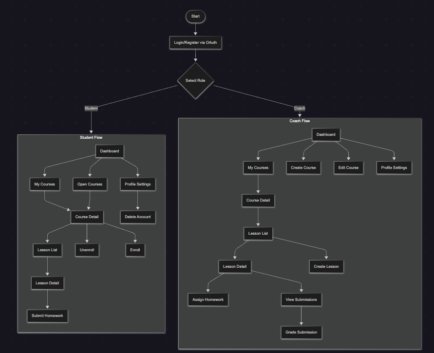
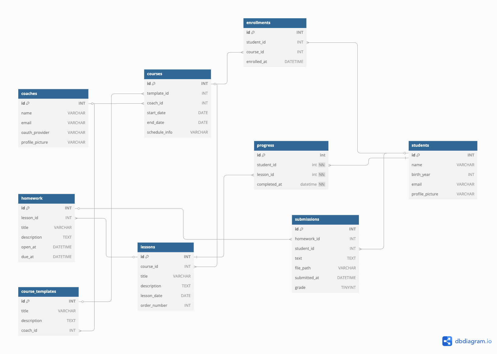
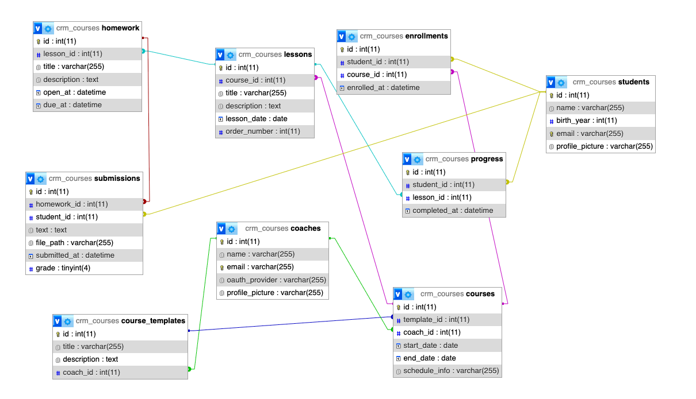

# CRM platforma pro dětské programovací kurzy

## Popis aplikace  
Webová aplikace určená lektorům a studentům pro správu a účast na dětských kurzech programování. Lektor (Coach) zadává kurzy a domácí úkoly, sleduje odevzdání, hodnotí je a spravuje svůj profil. Student si prohlíží své kurzy, odevzdává úkoly a také spravuje svůj profil.

---

## Typy uživatelů  
| Role    | Popis                                                                                 |
|---------|---------------------------------------------------------------------------------------|
| Student | Přihlásí se/registruje přes OAuth, prohlíží kurzy, odevzdává úkoly, spravuje profil.  |
| Coach   | Přihlásí se (předvytvořený účet), vytváří kurzy a úkoly, prohlíží odevzdání, zadává známky. |

---

## Popis funkcionalit  

| Funkce                     | Popis                                                                                  |
|----------------------------|----------------------------------------------------------------------------------------|
| Autentizace        | Přihlášení/registrace (i přes Google OAuth)                                               |
| Správa kurzů               | CRUD operace nad kurzy                                     |
| Správa studentů (enrollment)| Přihlášení/odhlášení studentů z kurzů                                                 |
| Zadání domácích úkolů      | Lektor zadá úkol s otevřením a termínem                                                |
| Odevzdání úkolů            | Student odevzdá text + soubor (< 25 MB)                                                 |
| Hodnocení odevzdání        | Lektor zadá známku 1–5                                                                   |
| Správa profilu             | Změna profilové fotky, hesla, smazání účtu                                             |
| Report pokroku             | Zobrazení stavu („hotovo“, „v procesu“, „nezačal“) pro každý projekt                    |

---

## Architektura  
- **Webový server:** Apache 2.4 (mod_rewrite, .htaccess)  
- **Back-end:** PHP 8+ (OOP, MVC – CodeIgniter/Laravel)  
- **Databáze:** MySQL 8 (InnoDB, utf8mb4)  
- **Front-end:** HTML5 (semantic), CSS3, Vanilla JS/Alpine.js, AJAX (fetch)  
- **Návrhový vzor:** MVC + Repository pattern  

---

## Komunikace  
- **Klient–Server:** HTTP GET/POST formuláře, generování stránek dle databázových dotazů
- **Server–DB:** PDO s prepared statements

---

## Use-case diagram  

---

## Procesní diagram  

---

## Sekvenční diagram  

---

## Výčet stránek  

| Stránka                            | Popis                                             |
|------------------------------------|---------------------------------------------------|
| `index.php`                        | Úvodní stránka / přehled kurzů                    |
| `login-choice.php`                 | Volba OAuth přihlášení                            |
| `login.php`                        | Formulář přihlášení                               |
| `signup.php`                       | Formulář registrace                               |
| `student/my-courses.php`           | Seznam kurzů studenta                             |
| `student/open-courses.php`         | Seznam otevřených kurzů                           |
| `student/course-detail.php?id=xx`  | Detail kurzu + přehled úkolů                      |
| `student/homework-detail.php?id=xx`| Detail úkolu + odevzdávací formulář               |
| `student/submit.php`               | Zpracování odevzdání (text + file)                 |
| `student/profile-settings.php`     | Úprava osobních údajů, fotky, hesla, smazání účtu |
| `coach/my-courses.php`             | Seznam kurzů lektora                              |
| `coach/course-detail.php?id=xx`    | Detail kurzu + seznam odevzdání                    |
| `coach/create-course.php`          | Formulář pro vytvoření kurzu                      |
| `coach/edit-course.php?id=xx`      | Editace kurzu                                     |
| `coach/manage-students.php?id=xx`  | Správa zápisů studentů                            |
| `coach/homework-detail.php?id=xx`  | Zadání/úprava domácího úkolu                      |
| `coach/grade.php?sub_id=xx`        | Zadání známky k odevzdání                         |
| `coach/profile-settings.php`       | Úprava profilu lektora                            |

## Wireframes

Wireframes

### Úvodní stránka

### Přihlášení / registrace
pages/login-choice  
  
pages/login  
  
pages/signup  

Student

pages/student/my-courses  
  
pages/student/open-courses  
  
pages/student/course-detail  
  
pages/student/course-detail (detail nezapsaného kurzu)  
  
pages/student/profile-settings  

pages/student/homework-detail
  
pages/student/submit-files
  

Coach

pages/coach/my-courses  
  
pages/coach/course-detail  
  
pages/coach/edit-course  
  
pages/coach/create-course  
  
pages/coach/manage-students  
  
pages/coach/homework-detail  
  
pages/coach/profile-settings  
  

---

## Databáze

### Logický model  

### Fyzický model  

---

### Popis tabulek  

### coaches

| Atribut         | Datový typ | Specifikace              |
|-----------------|------------|--------------------------|
| id              | INT        | PK, AUTO_INCREMENT       |
| name            | VARCHAR    | NOT NULL                 |
| email           | VARCHAR    | NOT NULL, UNIQUE         |
| oauth_provider  | VARCHAR    | NOT NULL                 |
| profile_picture | VARCHAR    | NOT NULL                 |

---

### students

| Atribut         | Datový typ | Specifikace              |
|-----------------|------------|--------------------------|
| id              | INT        | PK, AUTO_INCREMENT       |
| name            | VARCHAR    | NOT NULL                 |
| birth_year      | INT        | NOT NULL                 |
| email           | VARCHAR    | NOT NULL                 |
| profile_picture | VARCHAR    | NOT NULL                 |

---

### courses

| Atribut     | Datový typ | Specifikace               |
|-------------|------------|---------------------------|
| id          | INT        | PK, AUTO_INCREMENT        |
| title       | VARCHAR    | NOT NULL                  |
| description | TEXT       | NOT NULL                  |
| coach_id    | INT        | NOT NULL, FK → coaches.id |

---

### enrollments

| Atribut     | Datový typ | Specifikace                   |
|-------------|------------|-------------------------------|
| id          | INT        | PK, AUTO_INCREMENT            |
| student_id  | INT        | NOT NULL, FK → students.id    |
| course_id   | INT        | NOT NULL, FK → courses.id     |
| enrolled_at | DATETIME   | NOT NULL                      |

---

### progress

| Atribut      | Datový typ | Specifikace                   |
|--------------|------------|-------------------------------|
| id           | INT        | PK, AUTO_INCREMENT            |
| student_id   | INT        | NOT NULL, FK → students.id    |
| course_id    | INT        | NOT NULL, FK → courses.id     |
| project_name | VARCHAR    | NOT NULL                      |
| status       | VARCHAR    | NOT NULL                      |
| updated_at   | DATETIME   | NOT NULL                      |

---

### homework

| Atribut     | Datový typ | Specifikace               |
|-------------|------------|---------------------------|
| id          | INT        | PK, AUTO_INCREMENT        |
| course_id   | INT        | NOT NULL, FK → courses.id |
| title       | VARCHAR    | NOT NULL                  |
| description | TEXT       | NOT NULL                  |
| open_at     | DATETIME   | NOT NULL                  |
| due_at      | DATETIME   | NOT NULL                  |

---

### submissions

| Atribut      | Datový typ | Specifikace                        |
|--------------|------------|------------------------------------|
| id           | INT        | PK, AUTO_INCREMENT                 |
| homework_id  | INT        | NOT NULL, FK → homework.id         |
| student_id   | INT        | NOT NULL, FK → students.id         |
| text         | TEXT       | NOT NULL                           |
| file_path    | VARCHAR    | NOT NULL                           |
| submitted_at | DATETIME   | NOT NULL                           |
| grade        | TINYINT    | CHECK (grade BETWEEN 1 AND 5)      |

---

### Popis vztahů  

- **coaches 1:N courses**  
- **students M:N courses** přes enrollments  
- **students 1:N progress**, **courses 1:N progress**  
- **courses 1:N homework**  
- **homework 1:N submissions**, **students 1:N submissions**  
